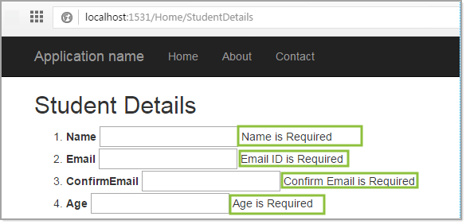

# FluentValidation

[Fluent Validation](https://docs.fluentvalidation.net/en/latest/installation.html) is a validation library for .NET, used for building strongly typed validation rules for business objects.

- Fluent validations use Fluent interface and lambda expressions to build validation rules.
- Fluent validation is a free-to-use .NET validation library that helps you make your validations clean and easy to both create and maintain.
- Works on external models that you don’t have access to, with ease. 

# Advantages of using Fluent Validations

- Decoupling validation rules and models- Fluent Validation allows you to separate validation rules from your model and helps you structure the rules so that they are nice and readable.
- Speed of execution- The rules are immutable[^1] objects meaning you can create them once and cache them. When the rules are part of the model, you’re needlessly setting them up every time. This is not a problem when working with one simple entity, but quickly becomes a performance problem when you’re working with multiple complex validators over thousands of rows. Benchmarking showed that we saved considerable time doing this – one import went from a huge amount of time to comparatively very less when we started caching validators.
- Efficient unit testing- Validation rules are super easy to test. 

# Notes

`Fluent validations` does not handle interacting with web interfaces as possible with `Data Annotations`.

## Data annotations

- [DisplayAttribute.Name Property](https://docs.microsoft.com/en-us/dotnet/api/system.componentmodel.dataannotations.displayattribute.name?view=net-6.0) Gets or sets a value that is used for display in the UI.
- [DisplayFormatAttribute Class](https://docs.microsoft.com/en-us/dotnet/api/system.componentmodel.dataannotations.displayformatattribute?view=net-6.0) Specifies how data fields are displayed and formatted by ASP.NET Dynamic Data.

[^1]: Unchanging over time or unable to be changed.