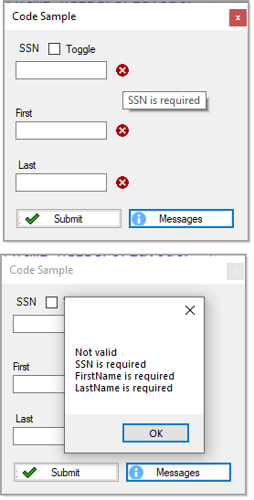

# About

This code sample uses two different paths for validating data, both are done when submitting data.

The first sets properties to a model and validates. 

The second uses a base class which implements [IDataErrorInfo](https://docs.microsoft.com/en-us/dotnet/desktop/wpf/data/how-to-implement-validation-logic-on-custom-objects?view=netframeworkdesktop-4.8) and a class, TaxPayer implements the base class. For this to work a BindingSource is needed even if working with one instance of, in this case TaxPayer.

The reason for validating on submit is because when presented with a new instance of a model, the error provider will kick in as in this case all properties are reqired.

---



- SSN is `123-22-4444` or `123224444`, not enough as done in unit test.
- First and LastName, only checks if there is at least one character, in the unit test most want at least three characters

- Microsoft [Overview of how to validate user input (Windows Forms .NET)](https://docs.microsoft.com/en-us/dotnet/desktop/winforms/input-keyboard/validation?view=netdesktop-6.0)
- Code Project [Validate user input in Windows Forms](https://www.codeproject.com/Articles/13922/Validate-user-input-in-Windows-Forms)
- Telerik [WinForms Validation provider](https://www.telerik.com/products/winforms/validation-provider.aspx)
- Telerik [ASP.NET](https://docs.telerik.com/aspnet-core/html-helpers/layout/form/validation)

```csharp
using System;
using System.Collections.Generic;
using System.Linq;
using System.Windows.Forms;
using SimpleValidation.Classes;
using SimpleValidation.Properties;

namespace SimpleValidation
{
    public partial class Form1 : Form
    {
        private readonly BindingSource _bindingSource = new BindingSource();
        private Taxpayer _taxpayer;
        public Form1()
        {
            InitializeComponent();

            errorProvider1.Icon = Resources.deleteIcon;
            
            Controls.OfType<TextBox>().ToList().ForEach(tb => errorProvider1.SetIconPadding(tb,10));

            SocialSecurityTextBox.ToggleShow(false);
            SocialSecurityTextBox.MaxLength = 11;

            _bindingSource.DataSource = new List<Taxpayer>() { new Taxpayer() };
            

            SocialSecurityTextBox.DataBindings.Add("Text", _bindingSource, nameof(Taxpayer.SSN));
            FirstNameTextBox.DataBindings.Add("Text", _bindingSource, nameof(Taxpayer.FirstName));
            LastNameTextBox.DataBindings.Add("Text", _bindingSource, nameof(Taxpayer.LastName));

        }

        private void checkBox1_CheckedChanged(object sender, EventArgs e)
        {
            SocialSecurityTextBox.ToggleShow(checkBox1.Checked);
        }

        private void SubmitButton_Click(object sender, EventArgs e)
        {
            errorProvider1.DataSource = _bindingSource;
            errorProvider1.DataSource = null;
        }

        private void ErrorMessagesButton_Click(object sender, EventArgs e)
        {
            _taxpayer = new Taxpayer()
            {
                FirstName = FirstNameTextBox.Text,
                LastName = LastNameTextBox.Text,
                SSN = SocialSecurityTextBox.Text
            };

            var (success, errorMessages) = ValidationOperations.IsValidTaxpayer(_taxpayer);
            MessageBox.Show(success ? "Valid" : $"Not valid\n{errorMessages}");
        }
    }
}

```