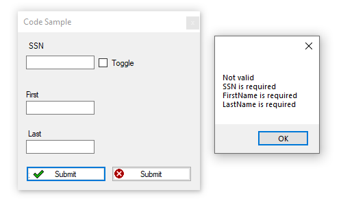

# About

Minimal validation on a model.

- SSN is `123-22-4444` or `123224444`, not enough as done in unit test.
- First and LastName, only checks if there is at least one character, in the unit test most want at least three characters