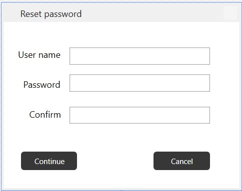

# About

#### Practical example

We have someone who needs to reset their password which usually requires a user name, current password followed by a new password and also a confirmation on the new password. In the following example it is missing the current password along with only code to validate user name and new password plus making sure both new password entries match.

The following is the window to collect information for a password reset.



XAML
```xaml
<Window x:Class="ValidateLogin.MainWindow"
    xmlns="http://schemas.microsoft.com/winfx/2006/xaml/presentation"
    xmlns:x="http://schemas.microsoft.com/winfx/2006/xaml"
    xmlns:d="http://schemas.microsoft.com/expression/blend/2008"
    xmlns:local="clr-namespace:ValidateLogin"
    xmlns:mc="http://schemas.openxmlformats.org/markup-compatibility/2006"
    Title="Reset password"
    Width="320.12"
    Height="251.129"
    Closing="MainWindow_OnClosing"
    KeyDown="Window_KeyDown"
    ResizeMode="NoResize"
    WindowStartupLocation="CenterScreen"
    Icon="sharp.ico"
    mc:Ignorable="d">


    <Window.CommandBindings>

        <CommandBinding
            CanExecute="PasswordCheckCanExecuteCommand"
            Command="{x:Static local:MainWindow.ContinueRoutedCommand}"
            Executed="PasswordCheckCommandOnExecute" />

        <CommandBinding
            CanExecute="ApplicationExitCanExecute"
            Command="{x:Static local:MainWindow.ExitRoutedCommand}"
            Executed="ExitApplicationCommandOnExecute" />

    </Window.CommandBindings>

    <Grid FocusManager.FocusedElement="{Binding ElementName=UserNameTextBox}">
        <Label
            Margin="14,30,0,0"
            HorizontalAlignment="Left"
            VerticalAlignment="Top"
            Content="User name"
            RenderTransformOrigin="0.45,0.261" />
        <TextBox
            Width="187"
            Height="23"
            Margin="88,34,0,0"
            HorizontalAlignment="Left"
            VerticalAlignment="Top"
            Text="{Binding UserName, UpdateSourceTrigger=PropertyChanged}"
            TextWrapping="Wrap" />
        <Label
            Margin="21,70,0,0"
            HorizontalAlignment="Left"
            VerticalAlignment="Top"
            Content="Password" />
        <Label
            Margin="29,110,0,0"
            HorizontalAlignment="Left"
            VerticalAlignment="Top"
            Content="Confirm" />
        <PasswordBox
            Width="187"
            Height="23"
            Margin="88,70,0,0"
            HorizontalAlignment="Left"
            VerticalAlignment="Top"
            PasswordChanged="PasswordTextBox_OnPasswordChanged" />
        <PasswordBox
            Width="187"
            Height="23"
            Margin="88,113,0,0"
            HorizontalAlignment="Left"
            VerticalAlignment="Top"
            PasswordChanged="PasswordConfirmTextBox_OnPasswordChanged" />
        <Button
            Width="75"
            Margin="23,173,0,0"
            HorizontalAlignment="Left"
            VerticalAlignment="Top"
            Command="{x:Static local:MainWindow.ContinueRoutedCommand}"
            Content="Continue" />
        <Button
            Width="75"
            Margin="200,173,0,0"
            HorizontalAlignment="Left"
            VerticalAlignment="Top"
            Command="{x:Static local:MainWindow.ExitRoutedCommand}"
            Content="Cancel" />

    </Grid>
</Window>
```

**Code behind**

- The variable _retryCount keeps track of failed attempts to reset a password which in this case missing information or passwords do not match. The password check is two-fold, a custom attribute, [PasswordCheck](https://github.com/karenpayneoregon/wpf-login-annotations-cs/blob/master/ValidateLogin/Classes/ValidationRules/PasswordCheck.cs) for ensuring the password has at least one symbol and one number. The second part is the [Compare](https://referencesource.microsoft.com/#System.ComponentModel.DataAnnotations/DataAnnotations/CompareAttribute.cs) attribute.
- The method process ProcessLogin passes the private variable _customerLogin of type [CustomerLogin](https://github.com/karenpayneoregon/wpf-login-annotations-cs/blob/master/ValidateLogin/Classes/CustomerLogin.cs) to the validator which in turn a check is made to see if there are validation errors, if so increment the retry count if under the limit or terminate. Otherwise if validation is successful open another window which would represent a main screen in an application or some may simply want to termiante as in real life this may very well be a stand along process.


```csharp
namespace ValidateLogin
{

    public partial class MainWindow : Window
    {
        private int _retryCount = 0;

        public static RoutedCommand ContinueRoutedCommand = new RoutedCommand();
        public static RoutedCommand ExitRoutedCommand = new RoutedCommand();

        private readonly CustomerLogin _customerLogin = new CustomerLogin();

        public MainWindow()
        {

            InitializeComponent();

            CommandBindings.Add(new CommandBinding(
                ContinueRoutedCommand, 
                PasswordCheckCommandOnExecute, 
                PasswordCheckCanExecuteCommand));

            CommandBindings.Add(new CommandBinding(
                ExitRoutedCommand, 
                ExitApplicationCommandOnExecute, 
                ApplicationExitCanExecute));

            DataContext = _customerLogin;

        }
        /// <summary>
        /// Validate user name and password logic for up to three failed attempts
        /// </summary>
        /// <param name="sender"></param>
        /// <param name="e"></param>
        private void PasswordCheckCommandOnExecute(object sender, ExecutedRoutedEventArgs e)
        {
            ProcessLogin();
        }
        /// <summary>
        /// Determine if rules for a resetting a password are met using property data
        /// annotation in the class CustomerLogin. Rules for a password are done
        /// in <see cref="PasswordCheck"/> class.
        /// </summary>
        private void ProcessLogin()
        {
            EntityValidationResult validationResult = ValidationHelper.ValidateEntity(_customerLogin);

            if (validationResult.HasError)
            {
                _retryCount += 1;

                if (_retryCount >= 3)
                {
                    MessageBox.Show("Too many attempts");
                    Application.Current.Shutdown();
                }
                else
                {
                    MessageBox.Show(validationResult.ErrorMessageList());
                }
            }
            else
            {
                Hide();

                var workWindow = new WorkWindow();
                Application.Current.MainWindow = workWindow;
                workWindow.ShowDialog();

                Close();
            }
        }

        private void PasswordCheckCanExecuteCommand(object sender, CanExecuteRoutedEventArgs e) => 
            e.CanExecute = _retryCount < 3;

        private void ExitApplicationCommandOnExecute(object sender, ExecutedRoutedEventArgs e)
        {
            if (Question("Cancel login?"))
            {
                Application.Current.Shutdown();
            }
        }

        private void ApplicationExitCanExecute(object sender, CanExecuteRoutedEventArgs e) => 
            e.CanExecute = true;

        private void MainWindow_OnClosing(object sender, CancelEventArgs e)
        {

            if (Environment.UserName == "PayneK")
            {
                Application.Current.Shutdown();
            }
            else
            {
                if (Question("Cancel login?"))
                {
                    Application.Current.Shutdown();
                }
                else
                {
                    e.Cancel = true;
                }

            }
        }
        /// <summary>
        /// Set confirm password to the logon object
        /// </summary>
        /// <param name="sender"></param>
        /// <param name="e"></param>
        private void PasswordConfirmTextBox_OnPasswordChanged(object sender, RoutedEventArgs e) => 
            _customerLogin.PasswordConfirmation = ((PasswordBox) sender).Password;

        /// <summary>
        /// Set password to the logon object
        /// </summary>
        /// <param name="sender"></param>
        /// <param name="e"></param>
        private void PasswordTextBox_OnPasswordChanged(object sender, RoutedEventArgs e)
        {
            _customerLogin.Password = ((PasswordBox)sender).Password;
        }

        private void Window_KeyDown(object sender, KeyEventArgs e)
        {
            if (e.Key == Key.Return)
            {
                ProcessLogin();
            }
        }
    }

}

```


