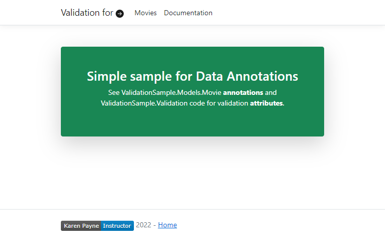

# Model validation in ASP.NET Core MVC and Razor Pages

- [Article](https://docs.microsoft.com/en-us/aspnet/core/mvc/models/validation?view=aspnetcore-5.0)
- [Git repository](https://github.com/dotnet/AspNetCore.Docs/tree/main/aspnetcore/mvc/models/validation/samples/3.x/ValidationSample)

Karen Payne has modified Microsoft's code sample here.

---

