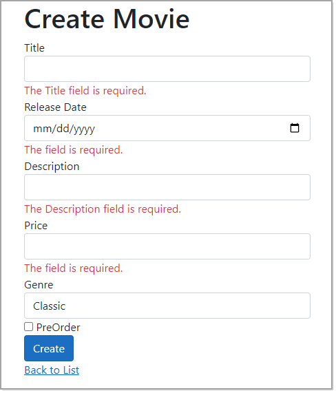
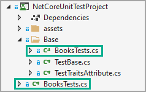
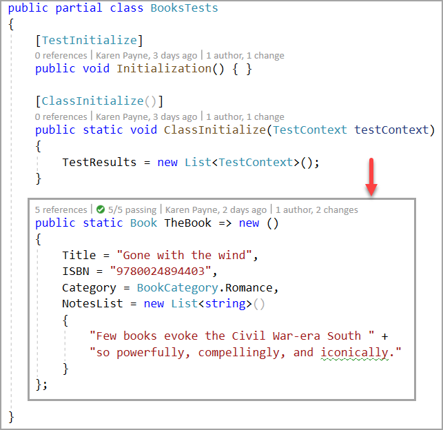

### Class/model validation basics


This repository provides various code samples for validating data using [data annotations](https://docs.microsoft.com/en-us/dotnet/api/system.componentmodel.dataannotations?view=net-5.0) and [FluentValidation](https://docs.fluentvalidation.net/en/latest/installation.html).

# Validating application data

Validation is the first and most important step in securing an application. It prevents the application from processing unwanted inputs that may produce unpredictable results. Couple validation with properly transmitting data to a data source.

When validating data should there be instant feedback? This is subjective, instant feedback will be better when there are many inputs so this would be better than waiting to submit their input. In the case of instant feedback there needs to be events triggered to perform validation while on submit there is a central generic method to perform validation.

Let's take another view of validating on submit, with all types of application which can be created with Visual Studio there are methods which permit displaying messages to assist the user to correct mistakes. So back to subjective, it may come down to if code is written in a team or individual in regards to, are there team rules or it's the Wild West.

## Preface

This repository contains validation code samples for user input, not validation of data coming from a database or other external sources, for working with databases and external sources that deserves it's own article.


## Data annotations

With ASP.NET Core using [data annotations](https://docs.microsoft.com/en-us/dotnet/api/system.componentmodel.dataannotations?view=net-5.0) the standard for validating a model is with the [Validator Class](https://docs.microsoft.com/en-us/dotnet/api/system.componentmodel.dataannotations.validator?view=net-5.0) which defines a helper class that can be used to validate objects, properties, and methods when it is included in their associated [ValidationAttribute](https://docs.microsoft.com/en-us/dotnet/api/system.componentmodel.dataannotations.validationattribute?view=net-5.0) attributes.


The ValidationAttribute class enforces validation, based on the [metadata](https://docs.microsoft.com/en-us/dotnet/api/system.componentmodel.dataannotations.metadatatypeattribute?view=net-5.0) that is associated with the data table. You can override this class to create custom validation attributes.

**Example**

```csharp
public class Person
{
    public int Id { get; set; }
    [RegularExpression("^.{3,}$", ErrorMessage = "{0} Minimum 3 characters required")]
    [Required(ErrorMessage = "{0} Required")]
    [StringLength(30, MinimumLength = 3, ErrorMessage = "Invalid {0}")]
    public string FirstName { get; set; }

    [RegularExpression("^.{3,}$", ErrorMessage = "{0} Minimum 3 characters required")]
    [Required(ErrorMessage = "{0} Required")]
    [StringLength(30, MinimumLength = 3, ErrorMessage = "Invalid {0}")]
    public string LastName { get; set; }

    [ValidateYears(ErrorMessage = "Valid range for BirthDate is from {0} to {1}")]
    [Required(ErrorMessage = "{0} Required")]
    public DateTime BirthDate { get; set; }
}
```
| Property        |   Attribute    |   Description |
|:------------- |:-------------|:-------------|
| FirstName | RegularExpression | Minimum 3 characters required |
|       | Required | Must have a value couple with above, minimum of three characters |
|       | StringLength | Min of three characters, max of 30 characters |
| LastName | RegularExpression | Minimum 3 characters required |
|       | Required | Must have a value couple with above, minimum of three characters |
|       | StringLength | Min of three characters, max of 30 characters |
| BirthDate | ValidateYears | Custom attribute for range of years |

To validate an instance of `Person`, set up a unit test method where all properties are valid.

```csharp
[TestMethod]
[TestTraits(Trait.Annotations)]
public void ValidPerson()
{

    // arrange
    Person person = new ()
    {
        FirstName = "Mike",
        LastName = "Flowers",
        BirthDate = new DateTime(1932, Now.Month, Now.Day)
    };

    // act
    EntityValidationResult result = Model.Validate(person);

    // assert
    Check.That(result.IsValid).IsTrue();
}
```

Next setup another test method, in this case BirthDate is out of range.

```csharp
[TestMethod]
[TestTraits(Trait.Annotations)]
public void InvalidDateValidPerson()
{
    // arrange
    DateTime date = new (2022, 4, 27);

    Person person = new ()
    {
        FirstName = "Mike",
        LastName = "Flowers",
        BirthDate = new DateTime(1931, date.Month, date.Day)
    };

    // act
    EntityValidationResult result = Model.Validate(person);

    // assert
    Check.That(result.IsValid).IsFalse();

}
```

In both test, the following code validates an instance of `person`

```csharp
EntityValidationResult result = Model.Validate(person);
```

Followed by asking if the instance of `person` is valid by `IsValid` method. Check is from [NFluent](https://www.n-fluent.net/).

```csharp
Check.That(result.IsValid).IsFalse();
```

- All code to validate are in a class project in this solution under [BaseDataValidatorLibrary](https://github.com/karenpayneoregon/ClassValidationVisualBasic/tree/net-core-version/BaseDataValidatorLibrary).
- For a list of stock validation attributes see [System.ComponentModel.DataAnnotations Namespace](https://docs.microsoft.com/en-us/dotnet/api/system.componentmodel.dataannotations?view=net-5.0).

## ASP.NET Core Razor

*Some inputs use default validation while others have custom rules.*



In markup, the following uses `asp-validation-for` tag helper, see [Validation Tag Helpers](https://docs.microsoft.com/en-us/aspnet/core/mvc/views/working-with-forms?view=aspnetcore-6.0#the-validation-tag-helpers) documentation for more information on usage..

```asp
<div class="row">
    <div class="col-md-4">
        <form method="post">
            <div asp-validation-summary="ModelOnly" class="text-danger"></div>

            <div class="form-group">
                <label asp-for="Movie.Title" class="control-label"></label>
                <input asp-for="Movie.Title" class="form-control" />
                <span asp-validation-for="Movie.Title" class="text-danger"></span>
            </div>

            <!-- <snippet_ReleaseDate> -->
            <div class="form-group">
                <label asp-for="Movie.ReleaseDate" class="control-label"></label>
                <input asp-for="Movie.ReleaseDate" class="form-control" />
                <span asp-validation-for="Movie.ReleaseDate" class="text-danger"></span>
            </div>
            <!-- </snippet_ReleaseDate> -->

            <div class="form-group">
                <label asp-for="Movie.Description" class="control-label"></label>
                <input asp-for="Movie.Description" class="form-control" />
                <span asp-validation-for="Movie.Description" class="text-danger"></span>
            </div>

            <div class="form-group">
                <label asp-for="Movie.Price" class="control-label"></label>
                <input asp-for="Movie.Price" class="form-control" />
                <span asp-validation-for="Movie.Price" class="text-danger"></span>
            </div>

            <div class="form-group">
                <label asp-for="Movie.Genre" class="control-label"></label>
                <select asp-for="Movie.Genre" asp-items="@(Html.GetEnumSelectList<Genre>())" class="form-control"></select>
                <span asp-validation-for="Movie.Genre" class="text-danger"></span>
            </div>

            <div class="form-group">
                <div class="checkbox">
                    <input asp-for="Movie.PreOrder" />
                    <label asp-for="Movie.PreOrder"></label>
                </div>
            </div>

            <div class="form-group">
                <input type="submit" value="Create" class="btn btn-primary" />
            </div>
        </form>
    </div>
</div>
```

In code behind the model `Movies` is setup as follows [BindProperty](https://docs.microsoft.com/en-us/dotnet/api/microsoft.aspnetcore.mvc.bindpropertyattribute?view=aspnetcore-5.0).

**BindPropertyAttribute**
An attribute that can specify a model name or type of IModelBinder to use for binding the associated property.
```csharp
[BindProperty]
public Movie Movie { get; set; }
```

In the Post action, [ModelState.IsValid](https://docs.microsoft.com/en-us/aspnet/core/mvc/models/validation?view=aspnetcore-5.0) validates or invalidates properties in the model.

**Model state** represents errors that come from two subsystems: model binding and model validation. Errors that originate from model binding are generally data conversion errors. 


```csharp
public async Task<IActionResult> OnPostAsync()
{
    if (!ModelState.IsValid)
    {
        return Page();
    }

    _context.Movies.Add(Movie);
    await _context.SaveChangesAsync();

    return RedirectToPage("./Index");
}
```

That's pretty much the basics for ASP.NET Core.

## Unit test examples

The following sections will demonstrate using mocked data in unit test methods.

The best method to test validating models is in unit test methods, devoid of user interfaces.

Simple example, we have a Book class, wired up for

For `Book` class these are how each property is setup with attributes for validation. 

| Property        |   Required    |   Uses custom attribute |
|:------------- |:-------------|:-------------|
| Title | &check; |  &cross; |
| ISBN | &check; |  &cross; |
| BookCategory | &check; |  &check;|
| NotesList | &check; |  &check;|


`BookCategory` is an `enum`

```csharp
public enum BookCategory
{
    Select = 1,
    SpaceTravel = 2,
    Adventure = 3,
    Romance = 4,
    Sports = 5,
    Automobile = 6
}
```

Which uses a custom custom attribute inheritied by RequiredAttribute to validate a property enum is used.


```csharp
public class RequiredEnumAttribute : RequiredAttribute
{
    public override bool IsValid(object sender)
    {
        if (sender == null)
        {
            return false;
        }

        var type = sender.GetType();
        return type.IsEnum && Enum.IsDefined(type, sender); ;
    }
}
```

`Notes` uses the following class to validate an instance of a `Book` has at least one note.

```csharp
public class ListHasElements : ValidationAttribute
{
    public override bool IsValid(object sender)
    {
        if (sender == null)
        {
            return false;
        }

        if (sender.IsList())
        {
            var result = ((IEnumerable)sender).Cast<object>().ToList();
            return result.Any();
        }
        else
        {
            return false;
        }
    }
}
```
The `Book class` should reside in a business class project while any `custom attribute classes` should reside in a common class project suitable for many projects to utilize rather than in a single project/application.

For this Visual Studio solution

- All `validation methods`, extension methods and custom attribute classes are in `BaseDataValidationLibrary`
- All `Classes/models` reside in the project `BaseModelsLibrary`

Let's look at testing a Book. There is a test class BooksTest marked as a partial class, the test are in the root folder of the test project while the second part is in the Base folder.



In the base folder we setup a valid Book instance for use in test methods in the root folder.




**First test**

Validates the model using valid data

```csharp
[TestMethod]
[TestTraits(Trait.Annotations)]
public void ValidateBook_Good_Test()
{
    // arrange
    Book book = TheBook;
    
    // act
    EntityValidationResult validationResult = Model.Validate(book);

    // assert
    Check.That(validationResult.HasError).IsFalse();
}
```


**Second test**

Ensure that the model is not valid as the `Category` property is `null`.

```csharp
[TestMethod]
[TestTraits(Trait.Annotations)]
public void ValidateBook_NoCategory_Test()
{
    // arrange
    Book book = TheBook;
    book.Category = null;
    const string expected = "Category is required";

    // act
    EntityValidationResult result = Model.Validate(book);

    // assert
    Check.That(result.Errors.Any(validationResult => 
        validationResult.ErrorMessage!.Contains(expected)))
        .IsTrue();
}
```

**Third test**

Ensure that the model is not valid as the `ISBN` property is `null`.

```csharp
[TestMethod]
[TestTraits(Trait.Annotations)]
public void ValidateBook_NoIsbn_Test()
{
    // arrange
    Book book = TheBook;
    book.ISBN = "";
    const string expected = "ISBN is required";

    // act
    EntityValidationResult result = Model.Validate(book);

    // assert
    Check.That(result.Errors.Any(validationResult => 
        validationResult.ErrorMessage!.Contains(expected)))
        .IsTrue();

}
```

That is it although we do not have full coverage for all paths the idea is to give the reader an idea how to get started. Consider writing more test against the book model for practice.


## FluentValidation

[FluentValidation](https://docs.fluentvalidation.net/en/latest/installation.html) is a validation library for .NET, used for building strongly typed validation rules for business objects.

Fluent validations use a Fluent interface and lambda expressions to build validation rules.

Customer class

```csharp
public class Customer : CustomerLogin
{
    public int Id { get; set; }
    public string FirstName { get; set; }
    public string LastName { get; set; }
    public string Email { get; set; }
    public decimal CreditLimit { get; set; }
    public int Discount { get; set; }
    public bool HasDiscount { get; set; }
    public string Address { get; set; }
    public string Postcode { get; set; }
    public string Pin { get; set; }
    public string SocialSecurity { get; set; }
    public DateTime BirthDate { get; set; }

    public override string ToString() => $"{FirstName} {LastName}";

}
```

Validator for Customer class/model

**Rules**

Some rules are not realistic, they are here to show what is possible.

- **Id** must be in the range from 1 to 10 
- **FirstName** can not be empty and valid length is 3 to 10 characters
- **LastName** can not be empty and valid length is 3 to 20 characters
- **Email** must be a valid email address
- **Discount** is only valid if `HasDiscount` property is set to true
- `**CreditLimit**` must be less than $9,999
- **Postcode** must be in the method `HasValidPostcode` list of postal codes
- **Pin** is converted from a string to an int and can not be greater than 8888
- **SocialSecurity** uses over the top validation using regular expressions in a language extension method.
- **BirthDate** can not be less than 01/01/1932

```csharp
public class CustomerValidator : AbstractValidator<Customer>
{
    public CustomerValidator()
    {

        RuleFor(customer => customer.Id)
            .InclusiveBetween(1, 10);

        RuleFor(customer => customer.FirstName)
            .NotEmpty()
            .Length(3, 10)
            .WithMessage("Please specify a first name");

        RuleFor(customer => customer.LastName)
            .NotEmpty()
            .Length(3, 20)
            .WithMessage("Please specify a last name");

        RuleFor(customer => customer.Email)
            .EmailAddress();

        RuleFor(customer => customer.Discount)
            .NotEqual(0)
            .When(customer => customer.HasDiscount);

        RuleFor(customer => customer.CreditLimit)
            .LessThanOrEqualTo(9999);


        RuleFor(customer => customer.Address)
            .MaximumLength(250);

        RuleFor(customer => customer.Postcode)
            .Must(HasValidPostcode)
            .WithMessage("Please specify a valid postcode");

        Transform(from: customer => customer.Pin, to: value => 
                int.TryParse(value, out int result) ? (int?)result : null)
            .GreaterThan(8888);

        Transform(
            from: customer => customer.SocialSecurity,
            to: value => value.IsSSNValid()).Must(value => value);

        RuleFor(customer => customer.BirthDate).GreaterThan(new DateTime(1932,1,1));
    }

    private static bool HasValidPostcode(string postcode)
    {
        List<string> list = new() { "97301", "97223", "97209", "97146", "97374", "97734" };
        var result = list.FirstOrDefault(item => item == postcode);
        return result is not null;
    }
}
```

Validating a Customer, as in the Book example we setp a valid customer in the base class for the test class.

```csharp
public partial class MainTest
{
    private CustomerValidator CustomerValidator;
    /// <summary>
    /// Perform initialization before test runs using assertion on current test name.
    /// </summary>
    [TestInitialize]
    public void Initialization()
    {
        CustomerValidator = new CustomerValidator();
    }

    /// <summary>
    /// Perform any initialize for the class
    /// </summary>
    /// <param name="testContext"></param>
    [ClassInitialize()]
    public static void ClassInitialize(TestContext testContext)
    {
        TestResults = new List<TestContext>();
    }

    public static Customer ValidCustomer => new Customer
    {
        Id = 1,
        FirstName = "Karen",
        LastName = "Payne",
        BirthDate = new DateTime(1956,9,24),
        Pin = "8889",
        Email = "kp@gmail.com",
        CreditLimit = 9999,
        Discount = 10, // TODO
        SocialSecurity = "205-55-1234",
        HasDiscount = true,
        Address = "101 Microsoft Way",
        Postcode = "97209"
    };
}
```

Then in the main test class, unit test for customers.

There are several methods used for validation.

- To check if a model is valid o rnot
  - Check.That(result.IsValid).IsTrue();
  - result.ShouldHaveValidationErrorFor(customer => customer.FirstName);
  - result.ShouldHaveValidationErrorFor(customer => customer.Email);


```csharp
[TestClass]
public partial class MainTest : TestBase
{

    [TestMethod]
    [TestTraits(Trait.FluentValidation)]
    public async Task CleanCustomerTest()
    {
        // arrange
        Customer thisCustomer = ValidCustomer;

        // act
        var result = await CustomerValidator.ValidateAsync(thisCustomer);

        // assert
        Check.That(result.IsValid).IsTrue();
    }


    [TestMethod]
    [TestTraits(Trait.FluentValidation)]
    public async Task CustomerNoFirstNameNoLastNameTest()
    {
        // arrange
        Customer thisCustomer = ValidCustomer;
        thisCustomer.FirstName = "";
        thisCustomer.LastName = "";


        // act
        var result = await CustomerValidator.TestValidateAsync(thisCustomer);
        
        // assert
        result.ShouldHaveValidationErrorFor(customer => customer.FirstName);
        result.ShouldHaveValidationErrorFor(customer => customer.LastName);

    }

    [TestMethod]
    [TestTraits(Trait.FluentValidation)]
    public async Task CustomerBadEmailTest()
    {
        // arrange
        Customer thisCustomer = ValidCustomer;
        thisCustomer.Email = "karenGmail";

        // act
        var result = await CustomerValidator.TestValidateAsync(thisCustomer);

        // assert
        result.ShouldHaveValidationErrorFor(customer => customer.Email);

    }

    [TestMethod]
    [TestTraits(Trait.FluentValidation)]
    public async Task CustomerInvalidPostalCodeTest()
    {
        // arrange
        Customer thisCustomer = ValidCustomer;
        thisCustomer.Postcode = "99999";

        // act
        var result = await CustomerValidator.TestValidateAsync(thisCustomer);

        // assert
        result.ShouldHaveValidationErrorFor(customer => customer.Postcode);

    }

    [TestMethod]
    [TestTraits(Trait.FluentValidation)]
    public async Task CustomerInvalidPrimaryKeyTest()
    {
        // arrange
        Customer thisCustomer = ValidCustomer;
        thisCustomer.Id = 0;

        // act
        var result = await CustomerValidator.TestValidateAsync(thisCustomer);

        // assert
        result.ShouldHaveValidationErrorFor(customer => customer.Id);

    }

    [TestMethod]
    [TestTraits(Trait.FluentValidation)]
    public async Task CustomerInvalidPinTest()
    {
        // arrange
        Customer thisCustomer = ValidCustomer;
        thisCustomer.Pin = "5555";  // must be greater than 8888

        // act
        var result = await CustomerValidator.TestValidateAsync(thisCustomer);

        // assert
        result.ShouldHaveValidationErrorFor(customer => customer.Pin);
    }

    [TestMethod]
    [TestTraits(Trait.FluentValidation)]
    public async Task CustomerBirthDateInvalidTest()
    {
        // arrange
        Customer thisCustomer = ValidCustomer;
        thisCustomer.BirthDate = new DateTime(1930, 1, 1);

        // act
        var result = await CustomerValidator.TestValidateAsync(thisCustomer);

        // assert
        result.ShouldHaveValidationErrorFor(customer => customer.BirthDate);
    }

    [TestMethod]
    [TestTraits(Trait.FluentValidation)]
    public async Task CustomerSocialSecurityNumberInvalidTest()
    {
        // arrange
        Customer thisCustomer = ValidCustomer;
        thisCustomer.SocialSecurity = "219-09-9999";

        // act
        var result = await CustomerValidator.TestValidateAsync(thisCustomer);

        // assert
        result.ShouldHaveValidationErrorFor(customer => customer.SocialSecurity);
    }
}
```


:raised_hand: **04/25/2022** version in branch [net-core-version](https://github.com/karenpayneoregon/ClassValidationVisualBasic/tree/net-core-version) includes C# .NET Core versions of original work done in .NET Framework.

# VB.NET

See [master branch](https://github.com/karenpayneoregon/ClassValidationVisualBasic)

Microsoft TechNet [.NET: Defensive data programming (Part 4) Data Annotation](https://social.technet.microsoft.com/wiki/contents/articles/53055.net-defensive-data-programming-part-4-data-annotation.aspx)